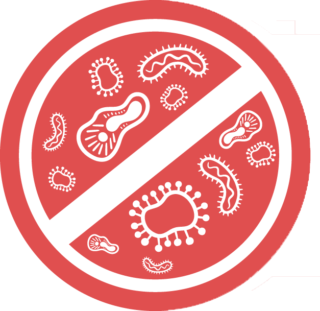
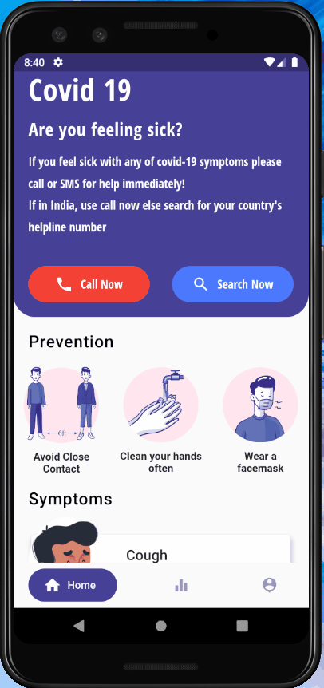
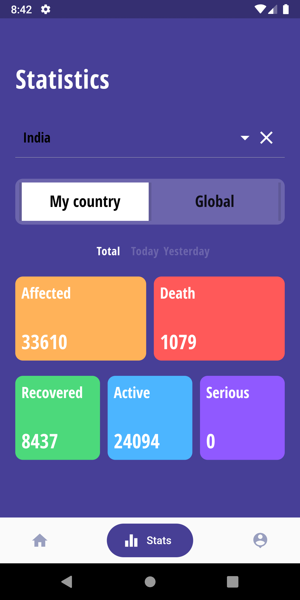
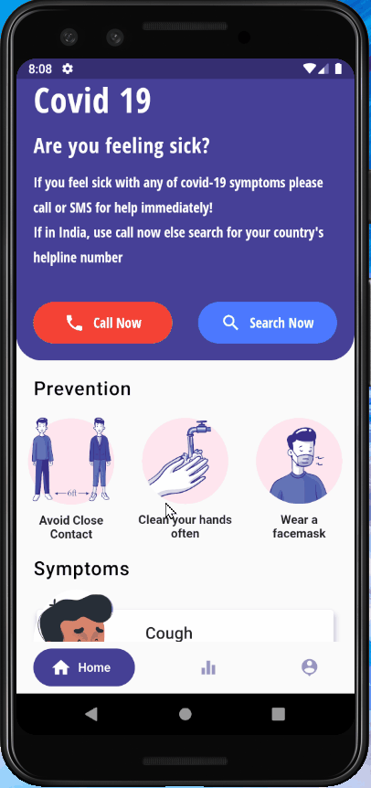

  
<h2 align="center">GoCoronaGo</h2> 

An informative app for the global pandemic - COVID19 built with flutter❤.

## About the app🤩

It provides all the basic details on COVID-19 such as it's symptoms, prevention, and LIVE updates on stats for all the countries and the world(i.e Total number of cases, deaths, recoveries etc.)

All of this packed in a beatiful UI inspired from the design by [simant0o](https://dribbble.com/shots/11015463-Covid-19-App-Free)

All the updates are fetched through an [API](https://thevirustracker.com/api) in real time so that you get the most updated details!

# Screens 📱

  

# In action 😎

  
 

 
This was my boredom buster while I am in quarantine sitting all the day at home.
SO, what are you waiting for, go get creative while staying home and staying safe!

#We are in this together!

Cheers!✨

